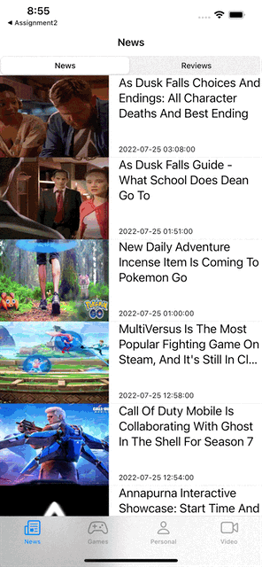
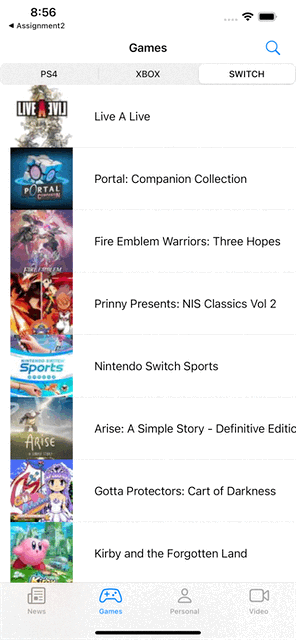
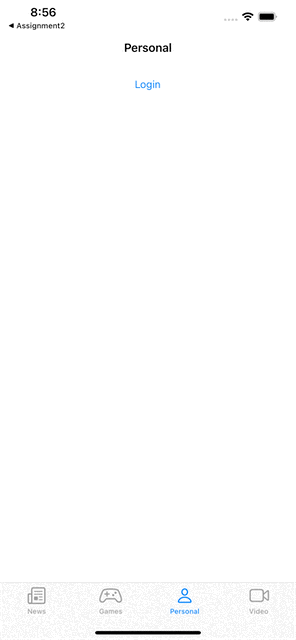
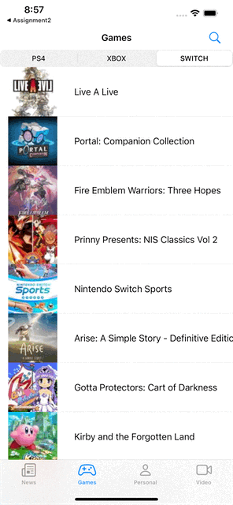

<!--
*** Thanks for checking out the Best-README-Template. If you have a suggestion
*** that would make this better, please fork the repo and create a pull request
*** or simply open an issue with the tag "enhancement".
*** Don't forget to give the project a star!
*** Thanks again! Now go create something AMAZING! :D
-->

<!-- PROJECT SHIELDS -->
<!--
*** I'm using markdown "reference style" links for readability.
*** Reference links are enclosed in brackets [ ] instead of parentheses ( ).
*** See the bottom of this document for the declaration of the reference variables
*** for contributors-url, forks-url, etc. This is an optional, concise syntax you may use.
*** https://www.markdownguide.org/basic-syntax/#reference-style-links
-->
[![Contributors][contributors-shield]][contributors-url]
[![Forks][forks-shield]][forks-url]
[![Stargazers][stars-shield]][stars-url]
[![Issues][issues-shield]][issues-url]
[![MIT License][license-shield]][license-url]
[![LinkedIn][linkedin-shield]][linkedin-url]

<!-- PROJECT LOGO -->
 

  

<h3 align="center">GameDB</h3>

  

    GameDB is a game info app developed in the IOS platform that aims to provide latest industry news and help gamers build their own virtual game library in order to organise all their games and progression in both local and cloud. 
     
    <a href="https://github.com/pt4300/gamedb"><strong>Explore the docs »</strong></a>
     
     
    <a href="https://github.com/pt4300/gamedb/issues">Report Bug</a>
    ·
    <a href="https://github.com/pt4300/gamedb/issues">Request Feature</a>
  

<!-- TABLE OF CONTENTS -->

  
Table of Contents

  <ol>
    <li>
      <a href="#about-the-project">About The Project</a>
      <ul>
        <li><a href="#built-with">Built With</a></li>
      </ul>
    </li>
    <li>
      <a href="#getting-started">Getting Started</a>
      <ul>
        <li><a href="#prerequisites">Prerequisites</a></li>
        <li><a href="#installation">Installation</a></li>
      </ul>
    </li>
    <li><a href="#usage">Usage</a></li>
    <li><a href="#contributing">Contributing</a></li>
    <li><a href="#license">License</a></li>
    <li><a href="#contact">Contact</a></li>
    <li><a href="#acknowledgments">Acknowledgments</a></li>
  </ol>

<!-- ABOUT THE PROJECT -->
## About The Project

![Product Name Screen Shot][product-screenshot]

The main focus of this application is to integrate news function and game collection function together to allow users to manage their game virtually and read the game articles in one single application. This saves users time on switching between different applications and thus improves the overall user experience. 

More importantly, Gamedb introduces cloud servers to keep users' data which allows them to manage their virtual library from any device without synchronisation issues. It also provides local storage for people who did not want to register an account with the application. This provides flexibility with different user groups as people who only use news functions will not be forced to register an account for using the application.

(<a href="#top">back to top</a>)

### Built With

* [![swift][swift]][swift-url]
* [![firebase][firebase]][firebase]

(<a href="#top">back to top</a>)

<!-- GETTING STARTED -->
## Getting Started

This is an example of how you may give instructions on setting up your project locally.
To get a local copy up and running follow these simple example steps.

### Prerequisites

This is an example of how to list things you need to use the software and how to install them.
* Latest Xcode

(<a href="#top">back to top</a>)

<!-- USAGE EXAMPLES -->
## Usage

 * checking  latest news 

 * checking  latest reviews 

 * checking  latest games 

 * searching  latest games 

 * register and login to personal account host at firebase 

 * adding game to favorite/wishlist host on firebase 

 * watching upcoming game teaser 

_For more detail, please refer to the [Design Documentation](https://github.com/pt4300/gamedb/blob/main/Design_doc.pdf)

(<a href="#top">back to top</a>)

<!-- CONTRIBUTING -->
## Contributing

Contributions are what make the open source community such an amazing place to learn, inspire, and create. Any contributions you make are **greatly appreciated**.

If you have a suggestion that would make this better, please fork the repo and create a pull request. You can also simply open an issue with the tag "enhancement".
Don't forget to give the project a star! Thanks again!

1. Fork the Project
2. Create your Feature Branch (`git checkout -b feature/AmazingFeature`)
3. Commit your Changes (`git commit -m 'Add some AmazingFeature'`)
4. Push to the Branch (`git push origin feature/AmazingFeature`)
5. Open a Pull Request

(<a href="#top">back to top</a>)

<!-- LICENSE -->
## License

Distributed under the MIT License. See `LICENSE.txt` for more information.

(<a href="#top">back to top</a>)

<!-- CONTACT -->
## Contact

Project Link: [https://github.com/pt4300/gamedb](https://github.com/pt4300/gamedb)

(<a href="#top">back to top</a>)

<!-- MARKDOWN LINKS & IMAGES -->
<!-- https://www.markdownguide.org/basic-syntax/#reference-style-links -->
[contributors-shield]: https://img.shields.io/github/contributors/pt4300/gamedb.svg?style=for-the-badge
[contributors-url]: https://github.com/pt4300/gamedb/graphs/contributors
[forks-shield]: https://img.shields.io/github/forks/pt4300/gamedb.svg?style=for-the-badge
[forks-url]: https://github.com/pt4300/gamedb/network/members
[stars-shield]: https://img.shields.io/github/stars/pt4300/gamedb.svg?style=for-the-badge
[stars-url]: https://github.com/pt4300/gamedb/stargazers
[issues-shield]: https://img.shields.io/github/issues/pt4300/gamedb.svg?style=for-the-badge
[issues-url]: https://github.com/pt4300/gamedb/issues
[license-shield]: https://img.shields.io/github/license/pt4300/gamedb.svg?style=for-the-badge
[license-url]: https://github.com/pt4300/gamedb/blob/master/LICENSE.txt
[linkedin-shield]: https://img.shields.io/badge/-LinkedIn-black.svg?style=for-the-badge&logo=linkedin&colorB=555
[linkedin-url]: https://linkedin.com/in/yuting-yu-5a34031b5/
[product-screenshot]: images/initial.png
[swift]: https://img.shields.io/badge/swift-000000?style=for-the-badge&logo=nextdotjs&logoColor=white
[swift-url]: https://developer.apple.com/xcode/

[firebase]: https://img.shields.io/badge/firebase-000000?style=for-the-badge&logo=nextdotjs&logoColor=white
[firebase-url]: https://firebase.google.com/?gclid=Cj0KCQjwof6WBhD4ARIsAOi65ahoKLLOWnIqM6xhYSczwrClRC6WOQ1B2Rj9Y-rCfciww6Ivq4if9-QaAo1fEALw_wcB&gclsrc=aw.ds
